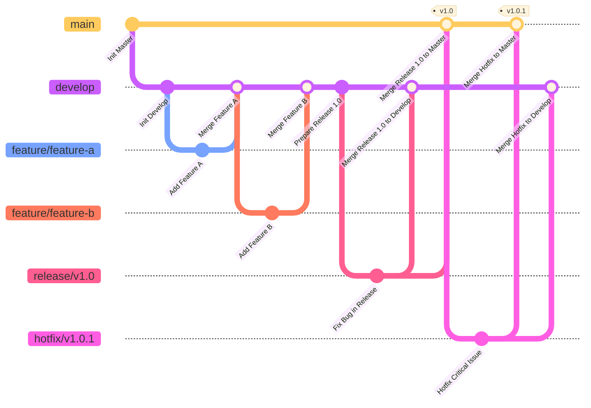

# 10/05會議紀錄

議前事項: 各位事先準備一個或多個專題提目
Date: October 5, 2024 20:00 (GMT+8)
議程: 題目投票 
→ 規格討論 (前後端語言/架構、DB 工具、branching model、merge or rebase) 
→ 成員內容分配

## 1.主題

難易度：API<DC<即時聊天<白板約等於成團

定案 → Rong：成團App 

### 成團app - GroupUp?

- 日期 顯示天氣狀態且內建個人行事曆 作為參團的考量
- 社群登入以同步帳號資訊
可選取對哪團活動有興趣 點擊關注
若決定入團 團體可設定匿名團或實名團
內同discord可以再分家
則公開帳號資訊 實名制參加
- 分為 出遊/課程/讀書團/團購/社團活動等等標籤可自由搜尋
可定位進行匿名開團
- 制定活動行程/課程大綱/讀書進度等等
可限制房號 朋友間可以傳送房號邀請
- 出遊可制定遊玩路線景點投票以及分帳系統，
活動結束後可回覆是否要再推薦類似成團活動，
可根據喜好進行每日推薦團體
- 有金額紀錄的團，需經過繳費認證後才可以退團，
- 顯示目前旅程安排進度，是否定案?
- 有個人日記可以記錄活動心情
- 取代 google 表單 能做意見統整

## 2.規格

- 手機app ( Andriod, iOS )
- 前端: **React native** / vue／Flutter
- 後端: flask / **golang** / express.JS
- DB: **SQL Lite**
- Branching model: **Git flow**

## 3. branch model

## 4. merge/rebase

- merge/rebase使用時機:
在上層: merge下層，EX: 在 dev，`merge feat`
在下層: rebase上層，EX: 在 feat，`merge --squash` feat

## 5. 分工

- 前端 ( UI/UX + code ) :
    - Rong
    - 0.5 Neo
    - 0.5 Ryan
- 後端 (資料庫) :
    - Ryan coding
    - Neo 資料庫建置、container分配
    - 子宏 coding
    - 0.5 Rong 努力學習

## 下周進度:

- Rong 先畫框架
- 這週討論框架修改

各自會碰到的技術

前端

- 畫 UI + function
- 學 TypeScript

後端

- 學 SQL
- 學 Golang

下周議程

- 框架定案
- Trello 專案管理

---

### 其他主題 (archieve)

neo:即時聊天系統

- FE: React Native
- BE: 後端（三層式架構)
- DB: postgreSQL

ryan有半成品

- [ ]  白板共享 + 討論室 類似 miro  - by Ryan
    - [ ]  臨時白板
    - [ ]  簡單討論室
    - [ ]  連結分享
    - [ ]  暫存 或 定時
    - [ ]  view by web or pdf
- [ ]  DC 討論室 生成器
    - [ ]  用文字 生成 聊天室
    - [ ]  ex: 第一組
        - 文字
        - 大廳
        1. 語音聊天
        2. KTV
    - [ ]  難點: discord bot, discord api
- [ ]  雲端硬碟 (??

hong:

利用某個具有API的某個功能，做出更近一步的應用，方向待確定

例子：[https://github.com/exilence-ce/exilence-ce](https://github.com/exilence-ce/exilence-ce)
[https://wealthyexile.com/](https://wealthyexile.com/).  

投票結果

